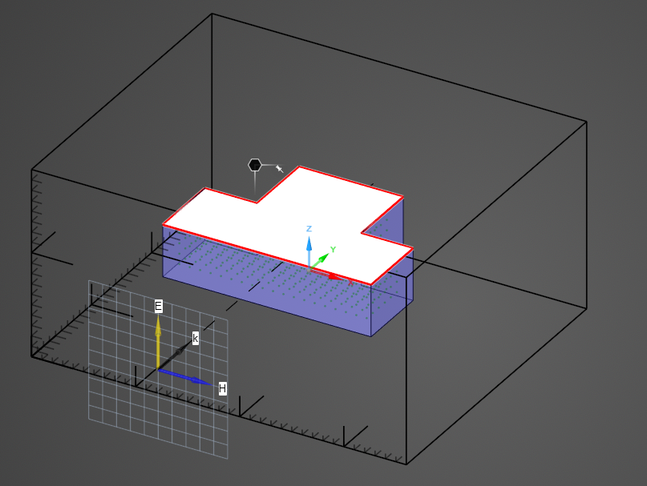
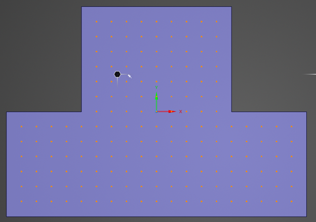
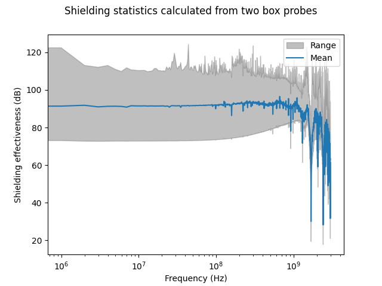

# Examples

The following sections discuss the demonstrations of EMAtools located in the "examples" directory. For details of execution, see scripts in this repository; for any other files, see K:/Griffin/EMAtools/examples.

## Shielding of an irregular box

The following example is based on a real customer use case that motivated much of the functionality in this package.

  The problem involves measuring the shielding effectiveness of an irregularly-shaped conductive enclosure with an EMI gasket, shown in Figure 1 below.

<p align="center"></p>
<p align="center">Figure 1: Shielding enclosure problem setup</p>
<br>

To characterize the shielding throughout the enclosure, two box field probes were added, as shown in Figure 2. The first is oriented horizontally along the longest wall of the enclosure, while the second fills the region protruding from the side.

<p align="center"></p>
<p align="center">Figure 2: Electric field box probes filling enclosure volume</p>
<br>

EMAtools provides a straightforward workflow for analyzing the simulation results. First, the data from the two box probes is loaded, as well as the plane wave source to be used as the reference waveform:

```
t, e = ema.load_box_probes(probe1_path, probe2_path)
tr, er = ema.load_data(ref_path)
```

In this example, the source waveform has a different time step and end time than the probe results. The `pad_to_time` and `resample` functions from the `signal` module are used to extend and match it to the time steps of the box probes:

```
tr, er = ema.pad_to_time(tr, er, t[-1])
tr, er = ema.resample(tr, er, t)
```

Now, the `shielding_from_timeseries` function from the `emc` module is called to calculate the shielding effectiveness:

```
f, se = ema.shielding_from_timeseries(t, e, er)
```

Finally, to obtain the minimum, mean, and maximum shielding through the entire enclosure, the `stats` function from the `signal` module is called. Note that `axis=0` is specified in order to calculate the statistics across all sample points.

```
se_min, se_mean, se_max = ema.stats(se, axis=0)
```

Plotting these results against frequency in Figure 3, we can see how shielding effectiveness varies throughout the enclosure:

<p align="center"></p>
<p align="center">Figure 3: Shielding statistics over all sample points</p>
<br>
